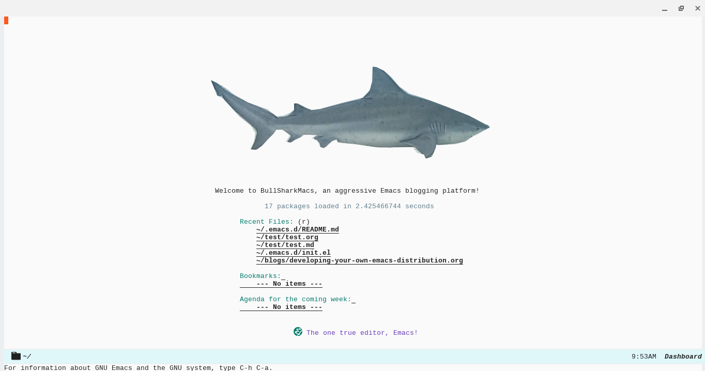

# README

## Disclaimer

This distribution is in early development. There is NO WARRANTY OF ANY KIND. USE AT YOUR OWN RISK!

## Requirements

- Emacs (tested on 27.1 / beginning testing on 26.2 - see notes below)
- Hermit font (free) can be downloaded [here](https://pcaro.es/p/hermit/).

## Testing on Emacs 26.2

- For emacs 26.2 copy file contents of early-init.el to init.el at top of file to get emacs to startup maximized. Still testing on 26.2 ...

## Screenshots



## Installation

To install backup your .emacs.d directory or .emacs file, move to another directory or remove and then type the following into your terminal:

```
git clone https://github.com/Tunkert/bullshark-macs ~/.emacs.d
```

After running that fire up Emacs - you might get some warnings ... (work in progress)

To get the doom-modeline to work properly run the command:

```
all-the-icons-install-fonts
```

This will install the fonts necessary for the modeline.

## Packages Included

Note: this is a work in progress, so far the packages included are:

- emmet-mode
- js2-mode
- markdown-mode
- doom themes (default theme is doom-acario-light right now)
- monokai theme (an alternative theme)
- php mode
- web mode
- olivetti
- dashboard
- doom-modeline
- yasnippets

## TODOS

- setup package for Jekyll blogging
- setup package for Hugo blogging

## Logo Attribution

[https://unsplash.com/photos/Dza3q36PFSs](https://unsplash.com/photos/Dza3q36PFSs) - this is the photo from Unsplash I cropped for the logo.
